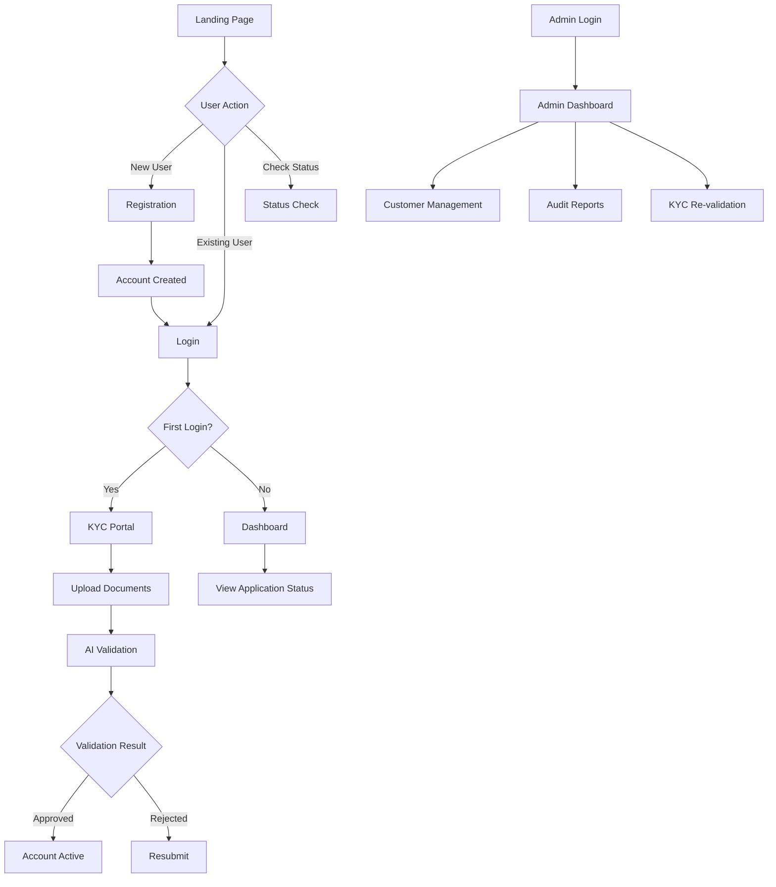
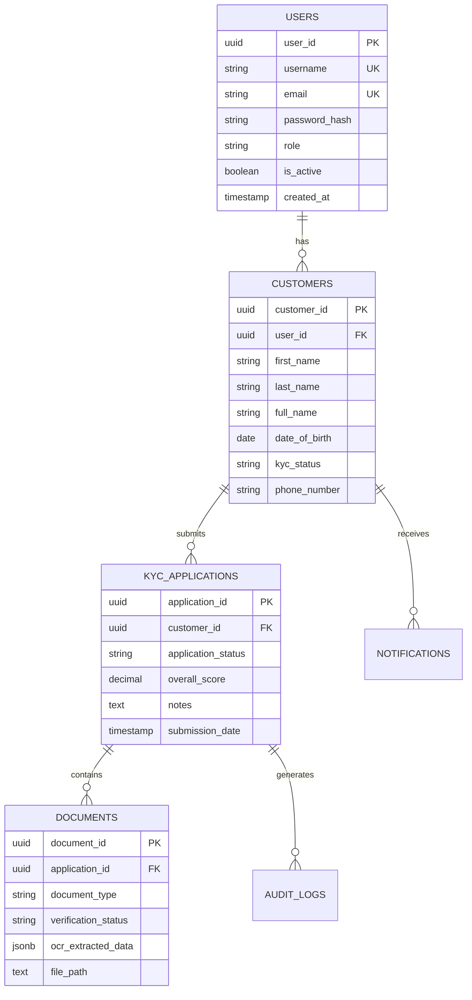
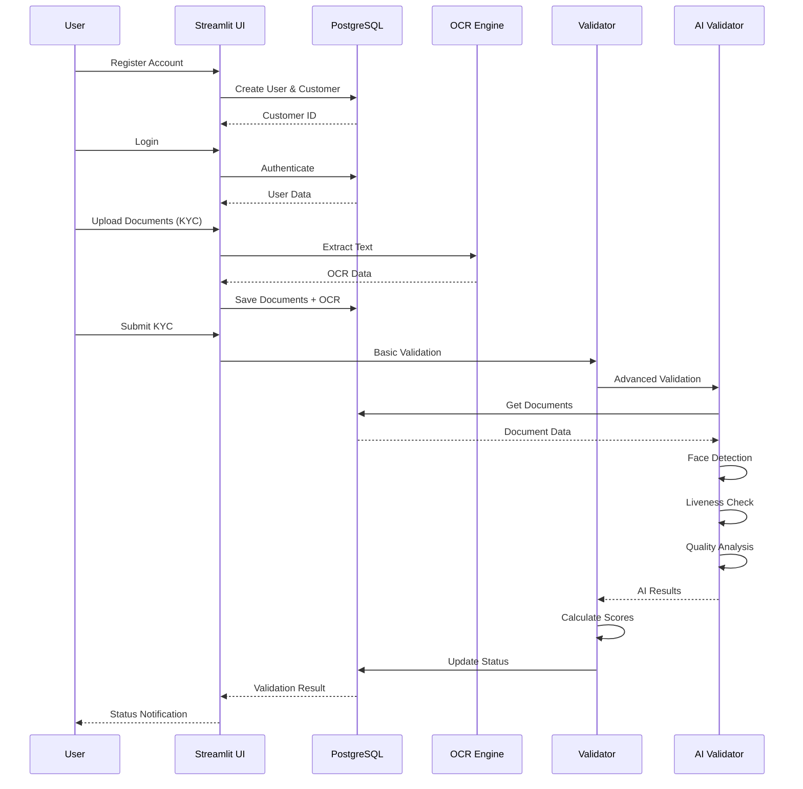

# Ti Tans Bank - KYC System Architecture

## System Overview

Ti Tans Bank KYC Portal is a comprehensive Know Your Customer (KYC) verification system built with Streamlit, PostgreSQL, and AI-powered validation engines. The system implements a progressive KYC flow where customers first register basic information, then complete identity verification on their first login.

### Core Purpose

The system enables:
- **Customer Registration**: Initial account creation with personal, employment, and address details
- **Progressive KYC Verification**: Two-stage onboarding (Registration → KYC Portal)
- **AI-Powered Document Validation**: Automated OCR extraction, face detection, liveness detection, and quality analysis
- **Admin Dashboard**: Comprehensive customer management, KYC review, and audit reporting
- **Status Tracking**: Real-time application status checking with 5-state logic

### User Flow



## File Manifest

### Active Production Files

| File | Primary Class/Module | Responsibility | Status |
|------|---------------------|----------------|--------|
| `app_main.py` | Main Application | Streamlit UI, routing, session management | **ACTIVE** |
| `database_config.py` | `DatabaseConfig` | PostgreSQL connection pooling, query execution | **ACTIVE** |
| `database_schema.sql` | SQL Schema | Database structure, tables, views, triggers | **ACTIVE** |
| `database_init.py` | Initialization Script | Database creation and schema initialization | **ACTIVE** |
| `db_helpers.py` | Helper Functions | User auth, customer CRUD, KYC operations | **ACTIVE** |
| `styling.py` | CSS Module | Professional banking UI styling | **ACTIVE** |
| `ocr_engine.py` | `OCREngine` | Text extraction from documents (Tesseract/mock) | **ACTIVE** |
| `kyc_validator.py` | Validation Functions | Basic KYC validation (photo, address, documents) | **ACTIVE** |
| `ai_kyc_validator.py` | AI Validation | Advanced AI features (face detection, liveness) | **ACTIVE** |
| `admin_dashboard.py` | `AdminDashboard` | Admin panel, application review | **ACTIVE** |
| `audit_reports.py` | Audit Module | Audit log generation and export | **ACTIVE** |
| `notifications.py` | Notifications | Toast notifications for user feedback | **ACTIVE** |
| `requirements.txt` | Dependencies | Python package dependencies | **ACTIVE** |

### Legacy/Inactive Files (Safe to Archive)

| File | Reason | Action |
|------|--------|--------|
| `main.py` | Replaced by `app_main.py` | **ARCHIVE** |
| `Sample.py` | UI reference, merged into `app_main.py` | **ARCHIVE** |
| `migrate_add_kyc_status.py` | One-time migration script | **ARCHIVE** |
| `migrate_add_kyc_status.sql` | One-time migration script | **ARCHIVE** |
| `migrate_all_missing_columns.sql` | One-time migration script | **ARCHIVE** |
| `verify_syntax.py` | Development utility | **ARCHIVE** |
| `generate_test_data.py` | Testing utility | **ARCHIVE** |
| `templates/index.html.py` | Unused template | **ARCHIVE** |

### Documentation Files (Reference)

| File | Purpose | Status |
|------|---------|--------|
| `README.md` | Main project documentation | **ACTIVE** |
| `SETUP_GUIDE.md` | Setup instructions | **ACTIVE** |
| `USER_MANUAL.md` | User guide | **ACTIVE** |
| `ADMIN_GUIDE.md` | Admin guide | **ACTIVE** |
| `ARCHITECTURE.md` | This file | **ACTIVE** |
| `FIXES_APPLIED.md` | Historical fixes log | **REFERENCE** |
| `KYC_VALIDATION_GUIDE.md` | KYC validation details | **REFERENCE** |
| Other `*_FIX.md` files | Historical documentation | **REFERENCE** |

## Backend & KYC Engine Deep Dive

### OCR Engine (`ocr_engine.py`)

**Purpose**: Extract and validate text from uploaded documents (Aadhar, PAN, Passport, Address Proof)

**Key Components**:
- **Tesseract Integration**: Uses `pytesseract` for OCR when available
- **Mock Fallback**: Provides mock OCR data when Tesseract is unavailable
- **Document Type Detection**: Automatically detects Aadhar vs PAN vs other documents
- **Pattern Matching**: Uses regex patterns to extract:
  - Aadhar numbers (12-digit format: `\b\d{4}\s?\d{4}\s?\d{4}\b`)
  - Names (multiple pattern variations)
  - Dates of birth
  - Addresses

**Validation Logic**:
```python
# Aadhar Validation Scoring:
- Aadhar Number Found: +30 points
- Name Extracted: +25 points
- Minimum Score for Validity: 70 points
- Confidence = min(100, completeness_score)
```

**Fuzzy Matching Techniques**:
- **Pattern-Based Extraction**: Regex patterns with multiple variations
- **Case-Insensitive Matching**: `re.IGNORECASE` flag for name extraction
- **Whitespace Normalization**: Removes spaces from extracted numbers
- **Multi-Pattern Fallback**: Tries multiple regex patterns if first fails

### KYC Validator (`kyc_validator.py`)

**Purpose**: Basic validation of photos, addresses, and documents

**Validation Components**:

#### 1. Photo Validation (`validate_photo`)
- **Dimensions Check**: Minimum 100x100px, maximum 10000x10000px
- **Aspect Ratio**: Should be between 0.3 and 3.0 (portrait/landscape/square)
- **File Size**: Between 1KB and 10MB
- **Scoring**:
  - Base score: 100
  - Too small: -20 points
  - Too large: -5 points
  - Bad aspect ratio: -10 points
  - File too small: -15 points
  - **Threshold**: Score ≥ 50 for validity

#### 2. Address Validation (`validate_address`)
- **Completeness Check**: Address, city, pincode must be present
- **Length Validation**: Address ≥ 5 chars, pincode ≥ 6 chars
- **OCR Cross-Reference**: Compares customer address with document OCR data
- **Common Word Matching**: Checks for street/road/lane/avenue/nagar/colony
- **Scoring**:
  - Base score: 100
  - Missing address: -15 points
  - Missing city: -10 points
  - Missing/invalid pincode: -10 points
  - Address mismatch: -15 points
  - **Threshold**: Score ≥ 70 for validity

#### 3. Document Validation (`validate_documents`)
- **Presence Check**: Identity document and photo required
- **Verification Status**: Counts verified vs pending documents
- **OCR Quality Check**: Validates OCR extraction results
- **Scoring**:
  - Base score: 100
  - Missing identity doc: -30 points
  - Missing photo: -25 points
  - Low verification rate (<30%): -10 points
  - OCR issues: -5 points per issue
  - **Threshold**: Score ≥ 50 for validity

#### 4. Overall KYC Validation (`perform_kyc_validation`)

**Weighted Scoring Formula**:
```python
overall_score = (
    photo_score * 0.3 +      # 30% weight
    address_score * 0.2 +    # 20% weight
    document_score * 0.5     # 50% weight
)
```

**Approval Criteria**:
- **Approved**: `overall_score >= 70` OR (`overall_score >= 60` AND `issues <= 2`)
- **Rejected**: Otherwise

**Status Updates**:
- Updates `kyc_applications.application_status` to 'approved' or 'rejected'
- Updates `customers.kyc_status` to 'Approved' or 'Rejected'
- Updates `documents.verification_status` based on overall result

### AI KYC Validator (`ai_kyc_validator.py`)

**Purpose**: Advanced AI-powered validation with production-ready features

**AI Features**:

#### 1. Face Detection (`detect_face_in_image`)
- **Technology**: OpenCV Haar Cascade Classifier
- **Detection Metrics**:
  - Face count
  - Face size ratio (face area / image area)
  - Face centering (offset from image center)
  - Face position and dimensions
- **Confidence**: 95% when face detected, 0% when not
- **Fallback**: Basic image analysis if OpenCV unavailable

#### 2. Liveness Detection (`detect_liveness`)
- **Image Properties Analyzed**:
  - Sharpness (Laplacian variance)
  - Color depth (RGB channels)
  - Resolution (width × height)
  - EXIF metadata presence
  - Compression artifacts
- **Scoring**:
  - Sharpness check: +20 points
  - Color depth check: +15 points
  - Resolution check: +15 points
  - EXIF check: +10 points
  - Compression check: +10 points
  - **Threshold**: Score ≥ 50 for liveness

#### 3. Image Quality Analysis (`analyze_image_quality`)
- **Quality Metrics**:
  - Brightness (mean pixel value)
  - Contrast (standard deviation)
  - Noise level (variance)
  - Resolution adequacy
  - Aspect ratio appropriateness
- **Scoring**: Each metric contributes to quality score (0-100)

#### 4. Advanced Photo Validation (`validate_photo_advanced`)
- Combines face detection, liveness, and quality analysis
- Returns comprehensive validation result with AI feature summaries

#### 5. Advanced Document Validation (`validate_document_advanced`)
- File size validation
- OCR quality assessment
- Verification status check
- Document type-specific validation

#### 6. Advanced KYC Validation (`perform_advanced_kyc_validation`)

**Weighted Scoring Formula**:
```python
overall_score = (
    photo_score * 0.40 +           # 40% weight (increased from 30%)
    address_score * 0.15 +         # 15% weight (reduced from 20%)
    identity_doc_score * 0.30 +    # 30% weight (new)
    photo_doc_score * 0.15          # 15% weight (new)
)
```

**Approval Criteria**:
- **Approved**: `overall_score >= 50` (more lenient for testing)
- **Rejected**: `overall_score < 50`

**Detailed Notes Format**:
```
[PASS/FAIL] Photo Validation: Score X%, Face: [detected/not detected], Liveness: [pass/fail], Quality: [good/fair/poor]
[PASS/FAIL] Address Validation: Score X%, Issues: [list]
[PASS/FAIL] Identity Document: Score X%, OCR: [quality], Verification: [status]
[PASS/FAIL] Photo Document: Score X%, Verification: [status]
Overall Score: X%
Status: [APPROVED/REJECTED]
Timestamp: YYYY-MM-DD HH:MM:SS
```

## Database Schema

### PostgreSQL Integration

**Connection Management** (`database_config.py`):
- **Connection Pooling**: Uses `psycopg2.pool.ThreadedConnectionPool`
- **Pool Size**: 1-10 connections (configurable)
- **Context Manager**: `get_connection()` ensures proper connection handling
- **Error Handling**: Automatic rollback on errors, commit on success

**Configuration**:
- Environment variables: `DB_HOST`, `DB_PORT`, `DB_NAME`, `DB_USER`, `DB_PASSWORD`
- Defaults: `localhost:5432`, database `horizon_bank_kyc`, user `postgres`

### Table Relationships



### Key Tables

1. **users**: Authentication and user accounts
2. **customers**: Customer profile data (progressive KYC fields)
3. **kyc_applications**: KYC application records with validation scores
4. **documents**: Uploaded documents with OCR data and verification status
5. **audit_logs**: System audit trail
6. **notifications**: User notifications

### Database Views

- `v_application_status_summary`: Aggregated application status
- `v_customer_kyc_dashboard`: Customer KYC overview with user email

### Triggers

- `update_updated_at`: Automatically updates `updated_at` timestamp on row modification

## Data Flow



## Dependency Tree

### Critical Libraries

| Library | Version | Role |
|---------|---------|------|
| `streamlit` | ≥1.28.0 | Web framework, UI rendering |
| `psycopg2-binary` | ≥2.9.9 | PostgreSQL adapter |
| `python-dotenv` | ≥1.0.0 | Environment variable management |
| `Pillow` | ≥10.0.0 | Image processing |
| `pandas` | ≥2.0.0 | Data manipulation, Excel export |
| `pytesseract` | ≥0.3.10 | OCR text extraction |
| `pdf2image` | ≥1.16.3 | PDF to image conversion |
| `openpyxl` | Latest | Excel file generation |
| `opencv-python` | Latest | Face detection, image analysis |
| `numpy` | ≥3.1.2 | Numerical operations, image arrays |

### Library Roles

- **Streamlit**: Primary UI framework, handles routing, forms, file uploads
- **Psycopg2**: Database connectivity, connection pooling, query execution
- **Pillow**: Image loading, dimension checking, format conversion
- **OpenCV**: Advanced image processing, face detection, quality analysis
- **Pytesseract**: OCR engine for text extraction from documents
- **Pandas**: Data manipulation for admin exports, reports
- **Openpyxl**: Excel file generation for audit reports

## Security Considerations

1. **Password Hashing**: SHA-256 (consider upgrading to bcrypt for production)
2. **SQL Injection Prevention**: Parameterized queries via psycopg2
3. **Session Management**: Streamlit session state for authentication
4. **File Upload Validation**: File type and size checks
5. **Audit Logging**: All user actions logged to `audit_logs` table

## Performance Optimizations

1. **Connection Pooling**: Reuses database connections
2. **Caching**: Streamlit `@st.cache_resource` for database initialization
3. **Lazy Loading**: Documents loaded on-demand
4. **Batch Operations**: Bulk updates for document verification

## Future Enhancements

1. **Real OCR Integration**: Replace mock OCR with production Tesseract setup
2. **Advanced Face Recognition**: Match photo with ID document photo
3. **Blockchain Integration**: Immutable audit trail
4. **API Endpoints**: RESTful API for mobile app integration
5. **Multi-language Support**: OCR for regional languages

